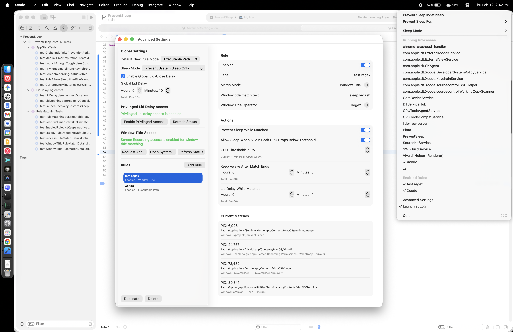

# PreventSleep

PreventSleep is a macOS menu bar app that keeps your Mac awake based on manual controls and user-defined matching rules.

- Target platform: macOS 15+
- UI: SwiftUI menu bar extra (`LSUIElement` app, no Dock icon)
- Project type: Xcode / XcodeGen-compatible (`project.yml` + generated `.xcodeproj`)

## Screenshot



## Features

- `Prevent Sleep Indefinitely` toggle from the menu bar.
- Timed keep-awake presets (`15m`, `30m`, `1h`, `2h`) and custom duration.
- Rule-based keep-awake:
  - Match by executable path
  - Match by process name
  - Match by window title (`contains`, `exact`, `regex`)
- Per-rule post-exit timer (`keepAwakeAfterExitSeconds`).
- Optional per-rule CPU-based auto-release:
  - Keep preventing sleep while matched
  - Allow sleep once 5-minute peak CPU falls below a configurable threshold (default `2%`)
  - Rule editor shows current 1-minute peak CPU to help tune thresholds
- Sleep assertion mode:
  - System sleep only
  - System + display sleep
- Running process list with one-click watch/unwatch toggles.
- Enabled-rules list in menu, including inactive-but-enabled rules.
- Advanced Settings for full rule editing and privileged lid-delay controls.
- Launch at login toggle.
- Optional lid-close delay (requires privileged setup):
  - Global lid delay and per-rule lid delay
  - Longest active delay wins

## How It Works

Sleep prevention is active when any of the following is true:

- Global indefinite toggle is ON
- Global manual timer is active
- An enabled rule with `preventWhileMatched` is currently matched (or, if CPU auto-release is enabled, while 5-minute peak CPU is still above threshold)
- A per-rule post-exit timer is currently active

### Rule matching

- Executable path: normalized absolute path exact match.
- Process name: case-insensitive exact match.
- Window title:
  - `contains`: case-insensitive substring
  - `exact`: case-insensitive full string
  - `regex`: case-insensitive NSRegularExpression
  - Requires macOS Screen Recording permission for PreventSleep to read other apps' window titles

### Lid-close delay behavior

On lid-close events:

1. Collect eligible delays from:
   - Global lid delay (if enabled)
   - Matched enabled rules with non-zero lid delay
2. Use the maximum delay.
3. If delay > 0 and privileged access is available:
   - Run `pmset -a disablesleep 1`
   - Hold until delay expires (or lid opens)
   - Run `pmset -a disablesleep 0`
   - If delay expires and lid is still closed, run `pmset sleepnow`

Crash recovery persists a marker and attempts to restore `disablesleep=0` on next launch.

## Requirements

- macOS 15.0+
- Xcode 16+ (Swift 6 toolchain)
- Optional: `xcodegen` if regenerating the project from `project.yml`

## Build and Run

### Open in Xcode

1. Open:
   - `PreventSleep.xcodeproj`
2. Select scheme:
   - `PreventSleep`
3. Run (`Cmd+R`)

The app appears in the menu bar.

### Command-line build

```bash
xcodebuild -project PreventSleep.xcodeproj \
  -scheme PreventSleep \
  -configuration Debug \
  -destination 'platform=macOS' \
  build
```

### Tests

```bash
xcodebuild -project PreventSleep.xcodeproj \
  -scheme PreventSleep \
  -configuration Debug \
  -destination 'platform=macOS' \
  test
```

### Regenerate project (if you edit `project.yml`)

```bash
xcodegen generate
```

## Advanced Settings and Privileged Access

Lid-delay features require non-interactive `sudo` access for narrowly scoped `pmset` commands.

From **Advanced Settings**:

1. Click `Enable Privileged Access`.
2. Authenticate in macOS admin prompt.
3. The installer writes:
   - `/etc/sudoers.d/preventsleep`
4. Click `Refresh Status` to confirm availability.

Installed sudoers scope:

- `/usr/bin/pmset -a disablesleep 0`
- `/usr/bin/pmset -a disablesleep 1`
- `/usr/bin/pmset sleepnow`

Installer script:

- `PreventSleep/Scripts/install_privileged_access.sh`

## Persistence

State is stored at:

- `~/Library/Application Support/PreventSleep/state.json`

Stored data includes:

- Global settings
- Rule list (enabled and disabled)
- Lid-override recovery marker

## Project Layout

- `PreventSleep/App` - app entry and SwiftUI views
- `PreventSleep/Domain` - core models and enums
- `PreventSleep/Services` - process/window scanning, power control, persistence, login item
- `PreventSleep/ViewModel` - app state and runtime logic
- `PreventSleepTests` - unit tests for matching, timers, lid-delay logic

## Codex Contributor Docs

- Agent instructions: `AGENTS.md`
- Detailed implementation playbook: `docs/CODEX_PLAYBOOK.md`

## Troubleshooting

### "Advanced Settings..." clicked but no visible window

This app is a menu bar-only app (`LSUIElement`). On some launches, macOS may log:

- `ordered front from a non-active application and may order beneath the active application's windows`

When this happens, the settings window may be behind other windows even though creation succeeded.

Try:

- `Cmd+Tab` to switch apps, then click menu item again
- Mission Control to locate hidden windows
- Close foreground full-screen spaces and retry

### Verify sleep assertion state

```bash
pmset -g assertions
```

### Lid-delay not working

- Confirm privileged status in Advanced Settings.
- Verify `/etc/sudoers.d/preventsleep` exists and is valid.
- Ensure at least one lid delay duration is enabled and > 0.

### Window-title rules never match

- In Advanced Settings, use the Window Title Access controls.
- Enable PreventSleep in `System Settings > Privacy & Security > Screen Recording`.
- Relaunch PreventSleep after granting access.

### Reset local app state

```bash
rm -f ~/Library/Application\ Support/PreventSleep/state.json
```

## Security Notes

- Privileged access is optional and only used for lid-delay behavior.
- Non-lid features (menu timers/rules for idle sleep prevention) work without privileged setup.
- This project is intended for local/distributed use, not Mac App Store sandbox constraints.
